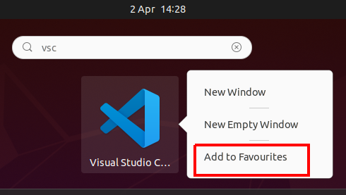
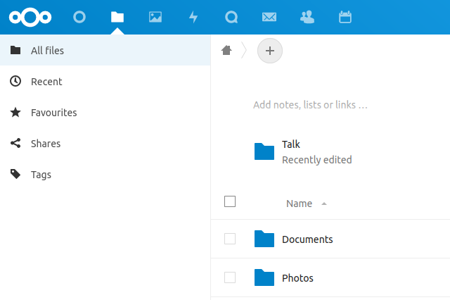

# 📈 1 Click Startup

* * * * *

📊 💬 📄

### Who is it for?

* * * * *

The owner of a small business such as a fast-food restaurant.

### What does it do?

* * * * *

With one click, a full IT system is set up for the business which will allow the business owner and employees to
interact with familiar software to make sure the work that needs done for their job gets done.

### How does it do this?

* * * * *

The end project will make use of open source software running in
[Docker](https://www.docker.com/) containers and using a
[Flask](https://flask.palletsprojects.com/en/1.1.x/) [REST API](https://www.youtube.com/watch?v=7YcW25PHnAA) webserver
to simplify interactions with the software services.

We also provide custom web user interfaces to help make running the business via these services intuitive.

- **Manager Interface.** The manager interface streamlines communication between the business entities: manager,
  employees, and suppliers
- **Employee Interface.** Employees fill in a series of digital forms which log important information about the
  processes they complete in their work.

### How do we test the system?

* * * * *

We also want to provide a testing framework with simulated users and managers using a tool such as
[PySelenium](https://selenium-python.readthedocs.io/). Tests are yet to be set up; more info is included in
our [TODO section](#next-steps) at the end of the project summary.

What's In This Document
-----------------------

* * * * *

- [Understanding a business](#understand-business)
- [Getting the current system up and running](#up-and-run)
- [Adding a new service](#new-service)
- [Custom Webserver](#custom-webserver)
- [Automated Employee Demo](#automated-employee-demo)
- [AI Manager Demo](#automated-manager-demo)
- [Adding Problems](#adding-problems)
- [Work Still to do](#next-steps)
- [Troubleshooting](#troubleshooting)

### 👤 Understanding a business

* * * * *

We want to solve problems our user is facing and improve their overall work-flow. In order to do that we need to define
our user and figure out more specific details regarding their current work-flows.

After conducting a survey with Google forms and an in person interview with a local business owner, the following use
cases have been identified. These are jobs we want to incorporate into our product to improve the user's workflow.

##### Use Cases

###### Manager Use Cases

<table>
            <tr>
                <th>Situation (When)</th>
                <th>Motivation (I want to)</th>
                <th>Expected Outcome (So I can)</th>
            </tr>
            <tr>
                <td>Stock is low</td>
                <td>Order Stock</td>
                <td>Be prepared for orders</td>
            </tr>
            <tr>
                <td>Employee joins</td>
                <td>Train employee</td>
                <td>Confidently put them on a shift</td>
            </tr>
            <tr>
                <td>Employee leaves</td>
                <td>Hire employee</td>
                <td>Have sufficient staff</td>
            </tr>
            <tr>
                <td>Customer complains</td>
                <td>Communicate with customer</td>
                <td>Find problem source</td>
            </tr>
            <tr>
                <td>Quality decreases</td>
                <td>Communicate with staff</td>
                <td>Get standards back to where they should be</td>
            </tr>
            <tr>
                <td>Shift ends</td>
                <td>Record sales</td>
                <td>Update accounts and make predictions</td>
            </tr>
            <tr>
                <td>Sales decrease</td>
                <td>Communicate with staff and investigate other local businesses
                </td>
                <td>Determine the cause of sales decreasing</td>
            </tr>
            <tr>
                <td>Product sells out</td>
                <td>Make product unavailable</td>
                <td>Stop taking orders</td>
            </tr>
            <tr>
                <td>Week is about to begin</td>
                <td>Send hours to staff</td>
                <td>Make any necessary changes</td>
            </tr>
            <tr>
                <td>Week is over</td>
                <td>Pay staff</td>
                <td>Keep their next wage payment separate</td>
            </tr>
            <tr>
                <td>Employee complains</td>
                <td>Communicate with employee</td>
                <td>Determine cause of complaint and potential solutions</td>
            </tr>
            <tr>
                <td>Bill arrives by post</td>
                <td>Pay bill</td>
                <td>Not accrue additional fees</td>
            </tr>
            <tr>
                <td>Problem with stock</td>
                <td>Contact supplier</td>
                <td>Get a refund or replacement</td>
            </tr>
</table>

###### Employee Use Cases

<table>
            <tr>
                <th>Situation (When)</th>
                <th>Motivation (I want to)</th>
                <th>Expected Outcome (So I can)</th>
            </tr>
            <tr>
                <td>Phone rings</td>
                <td>Answer</td>
                <td>Take order or answer customer query</td>
            </tr>
            <tr>
                <td>Order comes through app</td>
                <td>Read order</td>
                <td>Prepare order</td>
            </tr>
            <tr>
                <td>Shift begins</td>
                <td>Turn on equipment
                </td>
                <td>Prepare orders later</td>
            </tr>
            <tr>
                <td>Shift ends</td>
                <td>Turn off equipment</td>
                <td>Prevent fire risk and electricity cost</td>
            </tr>
            <tr>
                <td>There are no orders to be made</td>
                <td>Clean or prepare for future orders</td>
                <td>Be prepared for future orders</td>
            </tr>
            <tr>
                <td>Shift needs changed</td>
                <td>Communicate with management and colleagues</td>
                <td>Have colleague cover shift and hours updated</td>
            </tr>
            <tr>
                <td>Shift ends</td>
                <td>Lock shop</td>
                <td>Keep equipment and cash inside safe</td>
            </tr>
            <tr>
                <td>Shift ends</td>
                <td>Count cash
                </td>
                <td>Send sales details to manager</td>
            </tr>
            <tr>
                <td>Shift ends</td>
                <td>Clean and prepare equipment for next day</td>
                <td>Not be reprimanded</td>
            </tr>
            <tr>
                <td>Customer enters shop</td>
                <td>Approach customer</td>
                <td>Take their order</td>
            </tr>
            <tr>
                <td>Customer order ready</td>
                <td>Give it to the customer and take their payment</td>
                <td>Complete the order</td>
            </tr>
</table>

If we think about completing these tasks in terms of webpages we see that for communication or record keeping we can
provide forms on the user interface but for tasks which need performed physically such as turning off equipment we can
just provide a form to acknowledge that the task has been completed.

Open source software can enable us to automate some of the tasks required to run the business. Stock could be
automatically re-ordered for example. Open source document editing services can also be employed.

### 🛫 Getting the current system up and running

* * * * *

It may seem like a lot of initial setup if you're new to the tools but it'll be well worth it. Getting familiar with
these tools will put you in good stead to take your ability as a software engineer to the next level and will set you
apart from others interviewing for entry-level software engineering jobs and beyond.

Note that while some commands and screenshots are Linux based, they can be easily mapped to MacOS and Windows, and I'll
provide links throughout to other guides which demonstrate how to install certain tools on non-linux based operating
systems.

#### Set up Git and GitHub

We'll begin by getting the necessary files onto your machine with Git

From [The Odin Project - Introduction to Git](https://www.theodinproject.com/courses/foundations/lessons/introduction-to-git):

> "Git is like a really epic save button for your files and directories.
> Officially, Git is a version control system.

The next few steps have been adapted
from [The Odin Project - Configure Git (Linux or Mac) and Github (all operating systems)](https://www.theodinproject.com/courses/foundations/lessons/setting-up-git)

First we open a new terminal with the key combination `ctrl+alt+t` or alternatively search for "terminal"


From there we can run these commands in the terminal to update the Linux system

    sudo apt update
    sudo apt upgrade

And to install git

    sudo add-apt-repository ppa:git-core/ppa
    sudo apt update
    sudo apt install git

Now we can configure Git and GitHub. Be sure to enter your own information inside the quotes (but include the quotation
marks).

    git config --global user.name "Your Name"
    git config --global user.email "yourname@example.com"

We change Git's default branch (don't worry about the Git terminology here) to main to match GitHub's default branch
name

    git config --global init.defaultBranch main

Next you can go to [GitHub.com](https://github.com/) and create an account if you don't already have one.

That completes our Git setup.

After getting our project up and running, to get started with Git I recommend
returning [this video by Cory Schafer](https://www.youtube.com/watch?v=HVsySz-h9r4)
and [this Git lesson on The Odin Project](https://www.theodinproject.com/courses/foundations/lessons/git-basics). Try
not to feel too overwhelmed by all the commands at this point, as you'll soon find out there are only a few commands
you'll use in your
**basic Git workflow**

Now we can get all the files you need to get up and running on your machine.

The next few steps have been adapted from [GitHub Docs - Fork a repo](https://help.github.com/articles/fork-a-repo/)

On GitHub, we go to the [1 Click Startup repository](https://github.com/barrysweeney/1-click-startup)

We click to fork the repository, essentially creating a new copy that doesn't affect the original


Now we can clone the forked repository so you have the files available on your machine as well as on your GitHub
account.

You can modify the following URL with your GitHub username to find your forked repository:
[](#)https://github.com/YOUR-GITHUB-USERNAME/1-click-startup

We can click the code button above the list of files


Next, to clone the repository with HTTPS you can click the clipboard icon to copy the URL (note the URL should look like
https://github.com/YOUR-GITHUB-USERNAME/1-click-startup )


Now we can go back to our terminal and type git clone and paste the copied URL with `ctrl+shift+v`

It should look something like this

    git clone https://github.com/YOUR-GITHUB-USERNAME/1-click-startup

If we hit enter the local clone should be created and we should have all the files we need.

#### Set up Docker and Docker Compose

##### Set up Docker Engine

We'll install Docker so we can run our different services (frontend UI, database, etc) in containers to limit the number
of services we need to install locally.

From [Docker](https://www.docker.com/why-docker):

> "Containers are a standardized unit of software that allows developers
> to isolate their app from its environment, solving the “it works on my
> machine” headache. For millions of developers today, Docker is the de
> facto standard to build and share containerized apps"

This guide includes installing Docker engine on Ubuntu. For other operating systems, Linux platforms, and alternative
install methods I'll point you to these guides to

- [Install Docker Engine on Linux](https://docs.docker.com/engine/install/)
- [Install Docker Desktop on MAC](https://docs.docker.com/docker-for-mac/install/)
- [Install Docker Desktop on Windows](https://docs.docker.com/docker-for-windows/install/)

The following steps are adapted from [Install Docker Engine on Ubuntu](https://docs.docker.com/engine/install/ubuntu/)

If you think you may have some older versions of Docker installed tou can uninstall them with

    sudo apt-get remove docker docker-engine docker.io containerd runc

Next we'll set up the Docker repository. First we'll update the apt package index and install the packages that allow
apt to use a repository over HTTPS.

    sudo apt-get update
    sudo apt-get install \ apt-transport-https \ ca-certificates \ curl \ gnupg-agent \ software-properties-common

Next we'll add the official Docker GPG key:

    curl -fsSL https://download.docker.com/linux/ubuntu/gpg | sudo gpg --dearmor -o /usr/share/keyrings/docker-archive-keyring.gpg

And we can set up the stable repository with the following command

    echo \
      "deb [arch=amd64 signed-by=/usr/share/keyrings/docker-archive-keyring.gpg] https://download.docker.com/linux/ubuntu \
      $(lsb_release -cs) stable" | sudo tee /etc/apt/sources.list.d/docker.list > /dev/null

We can now install the latest version of Docker Engine and containerd

    sudo apt-get update
    sudo apt-get install docker-ce docker-ce-cli containerd.io

##### Set up Docker Compose

Next we'll install Docker Compose

From [Docker - Overview of Docker Compose](https://docs.docker.com/compose/):

> "Compose is a tool for defining and running multi-container Docker
> applications."

The following steps are adapted from [Docker - Install Docker Compose](https://docs.docker.com/compose/install/)

This is the command we can use to install Compose on Linux systems, for other systems and alternative install options
you can use [Docker - Install Docker Compose](https://docs.docker.com/compose/install/)

    sudo curl -L "https://github.com/docker/compose/releases/download/1.28.6/docker-compose-$(uname -s)-$(uname -m)" -o /usr/local/bin/docker-compose

And we can apply executable permissions with

    sudo chmod +x /usr/local/bin/docker-compose

#### Set up IDE

We'll be using Visual Studio Code (VS Code) for the purpose of this guide due to it's versatility; allowing us to code
JavaScript and Python in the same editor.

I think the easiest way is to open up Ubuntu Software which should appear when you start searching for "ubuntu"


From inside the Software store you can use the 🔎 icon and start searching for "vscode"


And we can now click the install button


We can now search for "vscode" and at this point I like to add to favourites so I can access VS Code from the
application drawer



THe following section of the tutorial draws
from [Getting Started with Python in VS Code](https://code.visualstudio.com/docs/python/python-tutorial) You can now
open a new window of Visual Studio Code


Now we can navigate to the extensions tab


And download the Python extension


As Ubuntu comes with Python3 pre-installed we can move on to installing pip. (For other Operating Systems you can see
options like brew for MacOS and WSL for Windows
in [Getting Started with Python in VS Code](https://code.visualstudio.com/docs/python/python-tutorial) )

To install pip...

    sudo apt install -y python3-pip

We can now open our Flask code and select our Python interpreter

From [Getting Started with Python in VS Code](https://code.visualstudio.com/docs/python/python-tutorial)

> "Python is an interpreted language, and in order to run Python code
> and get Python IntelliSense, you must tell VS Code which interpreter
> to use."

Inside the cloned 1-click-startup repository you'll see a folder
"1cs-backend" which you can right click to select open with other application


We can select VS Code and from here, we can install a virtual environment. Here's what the Visual Studio Code guide
referenced above has to say about them:

> "A best practice among Python developers is to avoid installing
> packages into a global interpreter environment. You instead use a
> project-specific virtual environment that contains a copy of a global
> interpreter. Once you activate that environment, any packages you then
> install are isolated from other environments. Such isolation reduces
> many complications that can arise from conflicting package versions."

Within VS Code you can use `` ctrl+alt+` `` to open a terminal and type the following to setup and activate the virtual
environment

    python3 -m venv .venv
    source .venv/bin/activate

We can use `ctrl+shift+p` to open the command palette and start typing
"python:select interpreter"


And select our interpreter from the menu (or navigate to the folder on your system)


We can install the packages required by our backend code by running the following command within our activated virtual
environment

    pip3 install -r requirements.txt

That's all the work done to set up our python backend. If you try to run the code now you'll still get errors because we
are yet to setup our database etc.

#### Run development containers

To run our development containers we'll navigate to where we've cloned the files locally which can be done by opening a
terminal with
`ctrl+alt+t`

From here we can change directory to the cloned repository with

    cd 1-click-startup

Now we can run

    sudo docker-compose up

The relevant ports are now exposed and can be accessed on your local machine

The **Frontend Interface** is accessible at <http://localhost:8000>

This frontend connects to the **Backend Webserver** at
<http://localhost:5000>

Requests are made from the backend to the **MySQL Database** at
<http://localhost:3306>

For more control over the database in development, a database graphical interface - **Adminer** - is accessible
at <http://localhost:8080>

To login we enter our server as "db", username as "root" and password as
"p@ssw0rd1"


This configuration information as well as other ports exposed for user automation can be found in
the `docker-compose.yaml` file at the root of the cloned directory.

Additional ports have been exposed such as

We'll dive a little deeper into this file when we move on to adding a service later but for now we can take a quick look
so you get the general idea of how we tell our application which services to start and what port to expose them on:


Essentially we either provide a path to a Dockerfile to build the service (as done with the backend service) or we name
the image as an existing service we want to use such as with the mysql image (this image is then pulled
from [Docker Hub](https://hub.docker.com/))

We don't need to worry too much about all of the commands right now as we'll see them again later when we're adding a
new service.

### 💽 Custom Webserver

* * * * *

From [Python Basic - What is Flask Python?](https://pythonbasics.org/what-is-flask-python/):

> "Flask is a web application framework written in Python. A Web
> Application Framework or simply a Web Framework represents a
> collection of libraries and modules that enable web application
> developers to write applications without worrying about low-level
> details"

When a user submits a form or clicks a button on the font-end user interface in their browser, a request is made to
certain endpoint on the
"backend" webserver. For example, when a user attempts to login, their email and password is sent to the Flask webserver
which then performs the authentication.

Let's start running through the code.

We start by importing the relevant packages which are either shipped with Python or installed using pip from
our `requirements.txt` file.

```python
# For handling requests and responses
import json
from flask import Flask, request
# For database connection
import mysql.connector
# For password encryption
from passlib.hash import sha256_crypt
# To enable requests from the frontend user interface
from flask_cors import CORS, cross_origin
```    

We then create and configure the app

```python
# Create Flask instance
app = Flask(__name__)
```

From [Flask - Application Setup](https://flask.palletsprojects.com/en/1.1.x/tutorial/factory/):

> `__name__` is the name of the current Python module. The app needs to
> know where it’s located to set up some paths, and `__name__` is a
> convenient way to tell it that.

Next, we use the `flask_cors` module to allow communication between our frontend interface and backend webserver.

```python
# Enable CORS to permit requests from the frontend to the backend (a different origin)
CORS(app) # Enables CORS for all routes
# Allow Content-Type header
app.config['CORS_HEADERS'] = 'Content-Type'
```

From [MDN Web Docs - CORS](https://developer.mozilla.org/en-US/docs/Web/HTTP/CORS):

> **Cross-Origin Resource Sharing** (CORS) is an HTTP-header based
> mechanism that allows a server to indicate any other origins (domain,
> scheme, or port) than its own from which a browser should permit
> loading of resources

Although we've created a dependency between the MySQL and Flask server containers in the `docker-compose.yaml` file
using `depends_on`, we still need to wait for the MySQL server *within* the container to be ready for connections.

```python
# Wait for MYSQL container to be ready for connection before allowing requests to database
ready = False
while not ready:
    try:
        # Connect to db with parameters matching docker-compose.yaml file
        mydb = mysql.connector.connect(
            host="db",
            user="root",
            password="p@ssw0rd1"
        )
        # Create cursor
        cursor = mydb.cursor()
        # Create and use database "startup" if it doesn't exist
        # TODO: Implement persistent database storage with volume mounting
        cursor.execute("CREATE DATABASE startup IF NOT EXISTS ")
        cursor.execute("USE startup")
        # Create "users" table if it doesn't exist
        cursor.execute(
            "CREATE TABLE IF NOT EXISTS users (id int(11) AUTO_INCREMENT PRIMARY KEY, name VARCHAR(255), email VARCHAR(255) UNIQUE , password VARCHAR(255), role VARCHAR(255), business VARCHAR(255))")
        # Close connection
        cursor.close()
        mydb.close()
        # Break out of while loop by setting ready to True
        ready = True
    except mysql.connector.errors.InterfaceError:
        # Try to connect to database again
        continue
```

Next we'll look at two routes in a little bit more detail. We'll first look at user registration as an introduction to
our authentication routes.

```python
# Authentication

# User registration route
@app.route('/register', methods=['POST'])
@cross_origin()
def register():
    # Get values from json request body
    data = request.json
    name = data['name']
    email = data['email']
    role = data['role']
    business = data['business']
    # Encrypt plain text password
    password = sha256_crypt.encrypt(data['password'])

    # Connect to db with parameters matching docker-compose.yaml file
    mydb = mysql.connector.connect(
        host="db",
        user="root",
        password="p@ssw0rd1",
        database="startup"
    )

    # Create cursor
    cursor = mydb.cursor()

    # Execute query to add user to database users table
    cursor.execute(
        "INSERT INTO users(name, email, password, role, business,) VALUES(?, ?, ?, ?, ?)",
        (name, email, password, role, business,))

    # Commit data to db
    mydb.commit()

    # Close connection
    cursor.close()
    mydb.close()

    # Return success message
    return json.dumps({'success': True}), 200, {'ContentType': 'application/json'}
```

Essentially what we have above is that the user will enter their email, password, business, and role, into a form on the
frontend. The data is then sent to the flask server which will store the users details in the database.

Next we'll take a look at the route used to complete a customer order.

```python
# Store new customer order in the database
# TODO: Restrict route to logged in users
# TODO: Link order to business
# TODO: Reduce stock level of ordered items
@app.route('/customer/order/new', methods=['POST'])
@cross_origin()
def customer_order():
    # get values from json request body
    data = request.json
    customer_name = data['name']
    contact_number = data['number']
    customer_order = data['order']

    # Connect to db with parameters matching docker-compose.yaml file
    mydb = mysql.connector.connect(
        host="db",
        user="root",
        password="p@ssw0rd1",
        database="startup"
    )

    # Create cursor
    cursor = mydb.cursor()

    # insert values from form into new record in CUSTOMER_ORDER table
    cursor.execute("INSERT INTO customer_order (customer_name, contact_number, customer_order) \
     VALUES (%s,%s,%s)", (customer_name, contact_number, customer_order))

    # Commit data to db
    mydb.commit()

    # Close connection
    cursor.close()
    mydb.close()

    # Return success message
    return json.dumps({'success': True}), 200, {'ContentType': 'application/json'}
```

You'll notice some similarities across the routes as we're typically doing the following steps:

- Extract data from request
- Connect to database
- Interact with database
- Close database connection
- Send response to user

One last thing we'll mention before we move onto adding a new service to the application is the idea of extracting data
from the URL. For example:

```python
# Get an employees details from the database using their id
@app.route("/employee/<id>")
def get_employee(id):
    return 'Not yet implemented'
```

Using the `<id>` syntax in the route and having the `id` as a method parameter allows us to use `id` inside the method
which will allow us to search the database by id for example.

### ➕ Adding a new service

* * * * *

Many small businesses use spreadsheets to manage payroll and sales predictions as opposed to expensive proprietary
specialized applications.

Let's add NextCLoud which will allow our user to use the integrated Collabora Office Online to manage and edit
documents.

Firstly, we'll need to modify our `docker-compose.yml` file to add the new service

```yaml
version: "3.7"

services:
  frontend:
    ...

  backend:
    ...

  adminer:
    ...

  db:
    ...

  nextcloud:
    image: nextcloud
    restart: always
    ports:
      - "80:80"

  pyselenium-employee:
    ...

  firefox:
    ...

  selenium-hub:
    ...
```

We set the image to pull from Docker Hub and map the port from within the container to `port 8080` on our local machine.

Next, we'll link this service to the custom frontend. We'll want NextCloud to be setup with the apps already installed
so we'll create a small python script to do that. This will have the dual effect of locking the route down to only the
manager since we could theoretically make the password to only them.

We'll create a new folder


Which we can then open with our IDE/text editor


And then open a new terminal within vscode with `` ctrl+alt+` `` and run

    touch app/main.py .gitignore Dockerfile

And we'll create ab activate our virtual environment with the following:

    python3 -m venv .venv
    source .venv/bon/activate

And now we can install our required packages with pip

    pip3 install selenium requests

From [Selenium](https://www.selenium.dev/):

> "Selenium automates browsers. That's it! What you do with that power
> is entirely up to you. Primarily it is for automating web applications
> for testing purposes, but is certainly not limited to just that.
> Boring web-based administration tasks can (and should) also be
> automated as well."

And we can head over to `app/main.py` and start importing these

```python
from selenium import webdriver
from selenium.webdriver.common.by import By
from selenium.webdriver.support import expected_conditions as EC
from selenium.webdriver.support.ui import WebDriverWait
import time
import requests
```

The selenium webdriver container is started along with the other services like the frontend, backend, and database, but
we need to wait for it to be ready for connections

```python
# Wait for Selenium webdriver container to be ready
ready = False
time.sleep(5)
while not ready:
    try:
        r = requests.get('http://172.17.0.1:4444/wd/hub/status', timeout=1)
        status = r.status_code
        if status == 200:
            ready = True
    except ConnectionResetError or ConnectionError:
        continue

driver = webdriver.Remote(desired_capabilities=webdriver.DesiredCapabilities.FIREFOX,
                          command_executor="http://172.17.0.1:4444/wd/hub")
```

We use `http://172.17.0.1` instead of `http://localhost` since we're communicating from within one container to a
different container, for more information about this bridge between networks using the host machine you can refer
to [this StackOverflow question by user klor](https://stackoverflow.com/q/48546124/9472445).

Now we can use this line of code

```python
# Go to create admin account page
driver.get("http://172.17.0.1:8080/")
```

Which will take us to this page


We can now input the username and password before clicking the finish setup button also on the page

```python
# Input username and password
WebDriverWait(driver, 300).until(EC.presence_of_element_located((By.ID, "adminlogin")))
WebDriverWait(driver, 300).until(EC.element_to_be_clickable((By.ID, "adminpass")))
driver.find_element_by_id("adminlogin").send_keys("admin")
driver.find_element_by_id("adminpass").send_keys("password")

# Click "Finish setup" button
driver.find_element_by_class_name("primary").click()
```

The ids where found by using the browsers inspect element feature


You can access this by pressing the F12 key when on the page or by right clicking the page and clicking "Inspect" ...
Another good tool to use is
`ctrl+shift_c` to pick an element from the page, as shown in the screenshot above.

We can now close our connection to the driver

```python
driver.close()
```

If we move over to our `Dockerfile` now we can containerize our automated admin

```dockerfile
FROM python:3.8

WORKDIR /app

COPY requirements.txt .
RUN pip install -r requirements.txt

COPY /app/main.py .

CMD ["python", "main.py"]
```

Of course we'll also need to create the requirements.txt file which we can do from the terminal (`` ctrl+alt+` ``)

     pip3 freeze > requirements.txt

Note there
is [an issue](https://stackoverflow.com/questions/39577984/what-is-pkg-resources-0-0-0-in-output-of-pip-freeze-command)
where a line `pkg-resources==0.0.0` is sometimes generated. If it is, you can safely remove this line
from `requirements/txt`

Now if we return to our main `docker-compose.yaml` file at the root of the cloned `1-click-startup` directory we can add
this automated admin service

```yaml
version: "3.7"

services:
  frontend:
    ...

  backend:
    ...

  adminer:
    ...

  db:
    ...

  nextcloud:
    ...

  pyselenium-admin:
    build: ./pyselenium-admin
    depends_on:
      - nextcloud

  pyselenium-user:
    ...

  firefox:
    ...

  selenium-hub:
    ...
```

Now the script will be run on startup to set up the NextCloud admin and the recommended apps (including document
editing) will be installed.

To complete adding this service to our application we'll also need a way to link to the NextCLoud document editing page
from our custom frontend interface.

We can open the `1cs-frontend` folder with VS Code as before

 

We'll go to `src/components/layout.js` and we can add a new `<ListLink>`

```html
...
return (
...
<ListLink to="/">Home</ListLink>
<ListLink to="/customer-order/">Customer Order</ListLink>
<ListLink to="/stock-count/">Stock Count</ListLink>
<ListLink to="/contact-manager/">Contact Manager</ListLink>
<ListLink to="http://localhost:8080/apps/files">Files</ListLink>
...
)
...
```

As you'll see, as opposed to relative, we've provided an absolute path to the NextCloud file editor.


Clicking this will take out user here



You can view what the PySelenium user is seeing with noVNC which you can access at <http://localhost:7902> and using the
password `secret` when prompted.

### 🤖 Automated Employee Demo

* * * * *

As one of the main goals of this project is to create automated users, it's worth exploring an example of one of the
tasks that have been automated.

We'll have [PySelenium](https://selenium-python.readthedocs.io/)
interact with our user interface to populate and submit a form to our backend
[Flask](https://flask.palletsprojects.com/en/1.1.x/installation/)
webserver which will then store data in a MySQL database.

When we run `sudo docker-compose up`{.language-bash} we're starting different containers relating to our application.

Our automated employee lives in one of these containers. With the following line of code, they can get the webdriver for
Selenium which allows them to access the web.

```python
driver = webdriver.Remote(desired_capabilitieswebdriver.DesiredCapabilities.FIREFOX,
            command_executor="http://172.17.0.1:4444/wd/hub")
```

We use `http://172.17.0.1` instead of `http://localhost` since we're communicating from within one container to a
different container, for more information about this bridge between networks using the host machine you can refer
to [this StackOverflow question by user klor](https://stackoverflow.com/q/48546124/9472445).

With the next line of code our automated employee can access the customer order page of the frontend user interface
which is in a different container accessible at port 8000 on our Docker network.

```python
driver.get("http://172.17.0.1:8000/customer-order")
```

This is what our employee now sees:


They can now fill in and submit the form:

```python
driver.find_element_by_id("customer-name").send_keys("John Doe")
driver.find_element_by_id("customer-contact-number").send_keys("+44700000010")
driver.find_element_by_id("customer-order").send_keys("Bottle Water")
driver.find_element_by_id("submit-customer-order").click()
```

If we look at the code for this form we can see that it is sending a
[POST](https://en.wikipedia.org/wiki/POST_(HTTP)) request to our backend Flask webserver running on port 5000 of our
Docker network (We take the letter we wrote in the frontend room to Flask's room).

```jsx
<form method="post" action="http://172.17.0.1:5000/customer/order/new">...
```

Let's look at what's happening over on the server side by visiting our Flask webserver.

```python
@app.route('/customer/order/new', methods=['POST'])
@cross_origin()
def customer_order():
    # get values from json request body
    data = request.json
    customer_name = data['name']
    contact_number = data['number']
    customer_order = data['order']

    # Connect to db with parameters matching docker-compose.yaml file
    mydb = mysql.connector.connect(
        host="db",
        user="root",
        password="p@ssw0rd1",
        database="startup"
    )

    # Create cursor
    cursor = mydb.cursor()

    # insert values from form into new record in CUSTOMER_ORDER table
    cursor.execute("INSERT INTO customer_order (customer_name, contact_number, customer_order) \
     VALUES (%s,%s,%s)", (customer_name, contact_number, customer_order))

    # Commit data to db
    mydb.commit()

    # Close connection
    cursor.close()
    mydb.close()

    # Return success message
    return json.dumps({'success': True}), 200, {'ContentType': 'application/json'}
```

We're extracting the data from the form that was posted and inserting it as an new record into our customer order table.

Although this is only a single [use case](#use-cases), that of an employee taking a customer order, it highlights the
flow of data through some of our integrated services.

Also note that this isn't a complete picture of our automated employee; there's a few ideas of how to expand on this
autonomous employee in the
[next steps](#next-steps) section.

### 📊 Automated Manager

* * * * *

We'll also want an automated manager so that we could simulate a day in the life of a small business. The jobs that get
done, the emails that get sent, the forms that get filled in, etc.

### ⛈ Adding work problems in the application

* * * * *

When we're designing our application we'll also want to introduce realistic problems that could occur and affect the
business operations. This could be anything from employees leaving, to global events effecting opening hours, etc.

In the simulation we can begin by including problems that are more likely to occur that would affect normal operations.
These could be implemented with appropriate randomness to make the simulation as plausible as possible.

A simple example might be that someone calls in sick last minute. This will have a domino effect and it will be
necessary to respond appropriately. We can map out these problem use cases in a table format as we have done with the
expected daily business use cases.

#### Example problem use cases

<table>
                <tr>
                    <th>Situation (When)</th>
                    <th>Motivation (I want to)</th>
                    <th>Expected Outcome (So I can)</th>
                </tr>
                <tr>
                    <td>Employee calls in sick</td>
                    <td>Ask another employee to cover the shift and update employees hours</td>
                    <td>Update payroll and not be understaffed</td>
                </tr>
</table>

### 📋 Next Steps

* * * * *

-   #### AI Users

    We could introduce the concept of "virtual time" to make our employee perform tasks at an accelerated rate and
    record these in the webapp. In addition to this, we'd also like the employee to perform their tasks based on what
    work is assigned to them through their custom webapp interface.

-   #### Persistent Storage

    At the minute our database storage isn't persistent so we could implement persistent data storage by creating a
    database dump when the user is finished with the application or periodically throughout the day and on startup the
    most recent database dump can be used to create and populate the database.

-   #### Email

    Adding an email service will allow communication between managers and employees as well as managers and suppliers.
    The Gmail Python package may be a plausible option for this. An alternative would be an integration with NextCloud's
    email feature.

-   #### Payroll

    Integration with a payroll service could allow small business owners to easily pay their employees based on their
    salary and hours worked which can be queried from the database.

-   #### Deployment

    The main final file to ship to the user is `user/start.sh` which essentially installs Docker to run
    the `docker-compose.yml` file and Firefox to access the frontend interfaces.

-   #### Authentication

    The apps authentication has been started but it will still be necessary to restrict routes to logged in users and
    also to use access-roles to restrict some routes to managers only.

-   #### Testing

    PySelenium could be used to set up automated tests to make sure that our system is behaving as expected.

-   #### Normal and problem use cases

    It'd be good to work towards implementing
    the [use cases in the table earlier in the project summary](#understand-business) and also
    possible [problem use cases](#adding-problems).

### Troubleshooting

`Error: for db ... 0.0.0.0:3306: bind: address already in use`

- to solve this you can find which process is using the port by running
  `sudo lsof -i -P -n | grep 3306` and use the id to end the process with
  `sudo kill id` for example \
  

When changes are made and they aren't updated when you run the docker-compose file it is sometimes necessary to rebuild
the images which you can do with the following command:
`sudo docker-compose                     build --no-cache`

It's important that the image version of `selenium-hub` and the
`firefox` selenium nodes are consistent since it's in pre-release beta

```yaml
firefox-1:
  image: selenium/node-firefox:4.0.0-beta-3-prerelease-20210402
  ...

  firefox-2:
    image: selenium/node-firefox:4.0.0-beta-3-prerelease-20210402
    ...

  selenium-hub:
    image: selenium/hub:4.0.0-beta-3-prerelease-20210402
    ...
```

When debugging problems with the automated users it may be useful to use strategically placed `print()`
{.language-python} statements to confirm the code is behaving as you expect.

`mysql.connector.errors.ProgrammingError: Not all parameters were used in                     the SQL statement`

- The problem may relate to the different parameter markers between sqlite3 and MySQL as explained
  in [this StackOverflow answer by user unutbu](https://stackoverflow.com/a/20818201/9472445)
